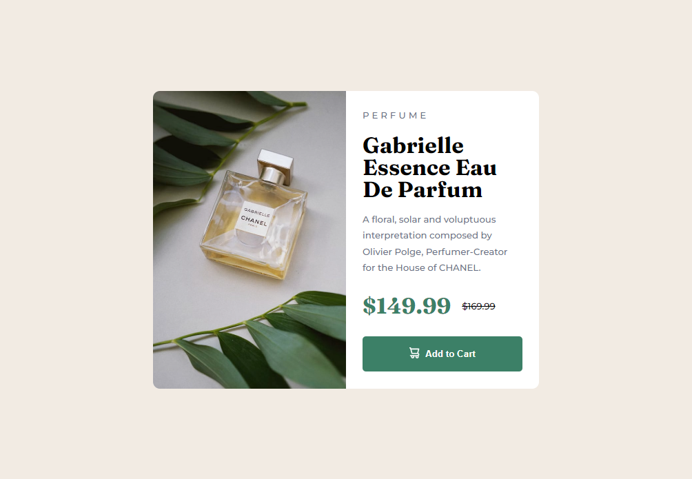

# Frontend Mentor - Product preview card component solution

This is a solution to the [Product preview card component challenge on Frontend Mentor](https://www.frontendmentor.io/challenges/product-preview-card-component-GO7UmttRfa). Frontend Mentor challenges help you improve your coding skills by building realistic projects.

## Table of contents

- [Overview](#overview)
  - [The challenge](#the-challenge)
  - [Screenshot](#screenshot)
  - [Links](#links)
- [My process](#my-process)
  - [Built with](#built-with)
  - [What I learned](#what-i-learned)
  - [Continued development](#continued-development)
  - [Useful resources](#useful-resources)
- [Author](#author)
- [Acknowledgments](#acknowledgments)

## Overview

### The challenge

Users should be able to:

- View the optimal layout depending on their device's screen size
- See hover and focus states for interactive elements

### Screenshot



### Links

- Solution URL: (https://www.frontendmentor.io/solutions/product-preview-card-component-GwTbHE3Bh4)
- Live Site URL: (https://dainty-boba-beeb91.netlify.app/)

## My process

1. Plan and outline the website
2. Set up the project
3. Add HTML5 semantic tags
4. Add CSS custom properties
5. Use Flexbox for layout
6. Style the website
7. Add CSS styling for mobile
8. Test and refine
9. Deploy the website

### Built with

- Semantic HTML5 markup
- CSS custom properties
- Flexbox

### What I learned

1. Using utility classes

```css
.flex-row {
  display: flex;
  flex-direction: row;
}

.flex-column {
  display: flex;
  flex-direction: column;
}

.bold-text {
  font-family: var(--secondary-font);
  font-weight: 700;
}

.light-text {
  font-weight: 500;
  color: var(--dark-grayish-blue);
}
```

2. Implementing responsive design

```html
<link
  rel="stylesheet"
  href="css/mobile.css"
  media="only screen and (max-width: 576px)"
/>
```

```css
.card {
  height: 90vh;
  flex-direction: column;
  align-items: stretch;
  justify-content: center;
}

.card .product-img,
.card .product-text {
  width: 100%;
}

.card .product-img {
  height: 40%;
}

.card .product-img img {
  object-position: 50% 30%;
}

.card .product-img .product-text {
  height: 60%;
}

@media (max-width: 361px) {
  .card {
    overflow: scroll;
  }
}
```

3. Testing and optimization on different devices and screen sizes

### Continued development

As of the writing of this section, I have no areas that I want to continue focusing on more in future projects.

### Useful resources

- [How To Use CSS Breakpoints For Responsive Design | LambdaTest](https://www.lambdatest.com/blog/how-to-use-css-breakpoints-for-responsive-design/) - This helped me to know what breakpoints should I use for mobile screen

## Author

- Frontend Mentor - [@erlanggaadptr](https://www.frontendmentor.io/profile/erlanggaadptr)

## Acknowledgments

I want to give a hat tip to LambdaTest for providing guide on how to use CSS breakpoints for responsive design
